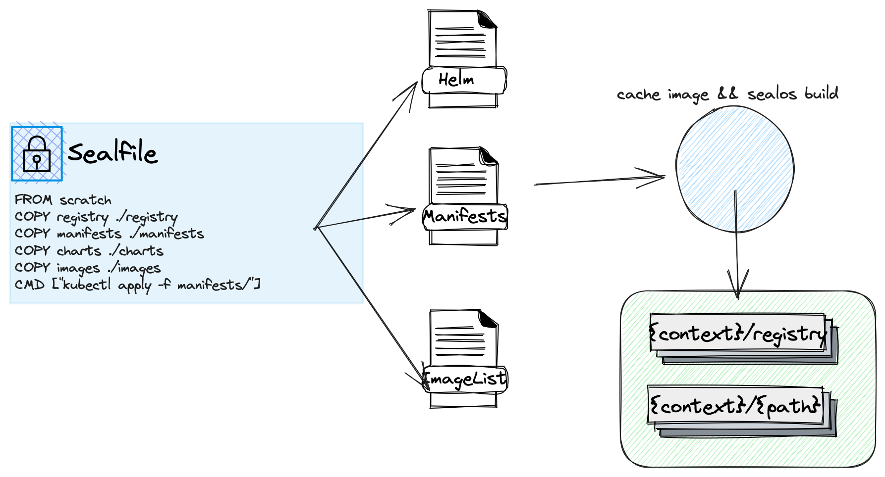
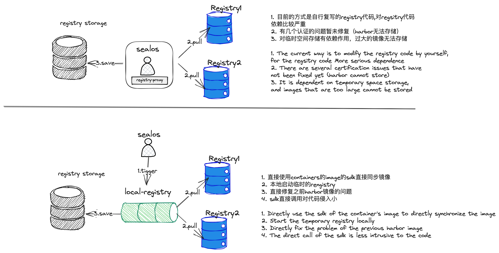

## 深入理解 Sealos 镜像构建

为了了解 Sealos 镜像构建的背后所做的工作，我们将首先揭示它在底层究竟进行了哪些操作。以下是一个直观的架构图：



Sealos 在构建镜像过程中涵盖了以下几个核心步骤：

- **缓存镜像**：解析构建执行时的工作目录 (在这里我们称之为 "context" 目录)，将缓存镜像保存到 registry 结构并存储在./registry 目录下。
- **构建镜像**：在 context 目录中进行镜像构建，生成新的镜像。(请注意，构建镜像时需要将./registry 目录进行复制。)

## 提升镜像构建效率

当前项目中，我们借用了 `github.com/distribution/distribution` 的源代码，在执行缓存镜像的过程中直接调用了 registry 的 sdk 并启动了 registry-proxy 功能。借助于镜像仓库的缓存能力，我们将镜像缓存并存入 context/registry 目录。

这个过程的关键就在于调用了 distribution 仓库的方法进行保存镜像：

- 启动 registry-proxy 功能。
- 保存镜像摘要及索引相关数据 (通过调用 saveManifestAndGetDigest 方法)。
- 保存镜像文件数据 (通过调用 saveBlobs 方法)。

这种方法确实具有一些显著的优点：

- 轻量化：无需依赖其他组件即可保存镜像。
- 自由控制：可以自由控制保存逻辑，无需依赖第三方组件。

然而，我们也注意到了一些潜在的问题：

- 对新手来说，代码理解难度较高，不易清晰了解这里的逻辑。
- 无法缓存使用 token 认证的方式。
- 需要依赖一些临时存储空间，对空间有要求。

考虑到这些问题，我们决定尝试一种新的模式：在本地启动一个轻量的 registry，使用 `skopeo copy` 的 sdk 进行代码复用。这一改变直接解决了之前所有的问题。



**所以，新的构建方式 ✨ 镜像仓库同步 ✨ 优雅登场 🎉🎉**

官方仓库中的[#3154](https://github.com/labring/sealos/pull/3154) 这个 PR 已经完成了这个功能的实现。目前，Sealos 支持这两种方式进行镜像构建。接下来，我会介绍如何启动新功能 (如果新功能表现稳定，我们可能会废弃旧的构建方式)。

## 如何启动新功能

> Sealos v4.3.0 以上版本默认支持此功能。

启动新功能非常简单，只需在你构建镜像之前添加一个环境变量即可。这个功能同时支持 build 和 merge 两个命令。

```shell
SEALOS_REGISTRY_SYNC_EXPERIMENTAL=true sealos build -t test .
```

以下是执行上述命令后的预期输出：

```tex
SEALOS_REGISTRY_SYNC_EXPERIMENTAL=true sealos build -t test .
Getting image source signatures
Copying blob fee740108510 done
Copying config f92f3ea6e4 done
Writing manifest to image destination
Storing signatures
Getting image source signatures
Copying blob 08409d417260 done
Copying config 44dd6f2230 done
Writing manifest to image destination
Storing signatures
2023-06-01T13:16:07 info saving images busybox, alpine
STEP 1/2: FROM scratch
STEP 2/2: COPY registry ./registry
COMMIT test
Getting image source signatures
Copying blob 13ab73c881c8 done
Copying config 4e22d16b36 done
Writing manifest to image destination
Storing signatures
--> 4e22d16b366
Successfully tagged localhost/test:latest
4e22d16b366e9fec25641522a74cbd73a7db67dc0516b8f8e00200c4d0551592
```

希望以上内容可以帮助您更好地理解并使用 Sealos 的新镜像构建方式。
